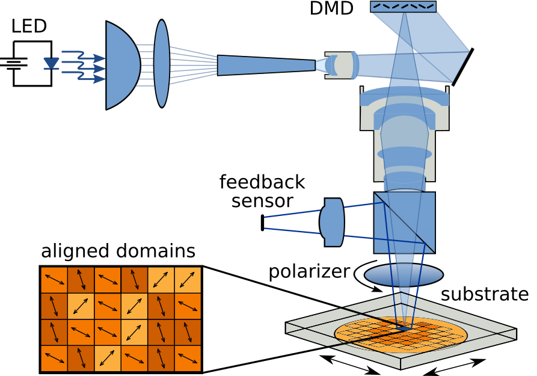

# Photoalignment
This matlab project is used for a multi-step, multi-mask exposure system using:
- a projector implemented as second screen to project masks,
- a motorized rotation stage used for defining the polarization of the exposure,
- a motorized xy-stage to define the exposure position,
- a humidity/temperature sensor hooked up through serial connection,
- a current source for controlling a light source, also hooked up as serial connection.

# Features
- works on MATLAB 2018b
- tested on Ubuntu 18.04, Windows 7, Linux Mint 19, Linux Mint 20
- interfacing commands for Standa stages

# Use
It is used for research on liquid crystals and is able to control photoalignment over various substrate sizes.

## contributions by
**Sanket B. Shah**

## code used from
* Pithawat Vachiramon (`fullscreen`, `closescreen`)  
  https://de.mathworks.com/matlabcentral/profile/authors/870479-pithawat-vachiramon
* MathWorks Support Team (`newid`)  
  https://de.mathworks.com/matlabcentral/answers/96640-how-can-i-modify-the-inputdlg-function-to-make-the-enter-key-synonymous-with-the-ok-button-in#answer_105991
* Standa LTD, ximc libraries  
  https://standa.lt, https://doc.xisupport.com/en/index.html

## License
This project is licensed under the GNU General Public License v3.0 - see the [LICENSE](LICENSE) file for details
